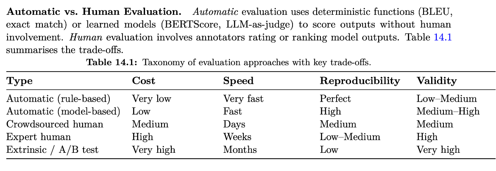

# Evaluating large language models

Once a model has been trained, whether through the full training pipeline or
through our own fine-tuning, we need to answer a simple question: is it any
good?

For many machine learning models, this question has a fairly direct answer. An
image classifier is compared with the correct labels, and accuracy summarises
the result. A generative language model is harder to assess. Its output is
free text, many different answers can be correct, and "good" can mean
accurate, helpful, concise, safe, or well written, depending on who is asking.

This section describes the main ways a trained LLM can be evaluated, what each
approach is useful for, and where each approach breaks down. It then looks at
benchmarks, the most common way models are compared, and explains why a
benchmark score should not be read as a direct measure of a model's
intelligence.

:::{questions}

- Why is evaluating a generative language model harder than evaluating a
  classifier?
- What are the main ways of evaluating a trained LLM?
- What are the limitations of each evaluation approach?
- How does LLM-as-a-judge work, and when can it be trusted?
- What do benchmark scores tell us, and what do they not tell us?
- What changes when the model is evaluated in a language other than English?

:::

:::{objectives}

By the end of this section, learners should be able to:

- explain why a single number rarely captures the quality of generated text;
- describe loss-based, reference-based, verifiable, human, model-based, and
  preference-based evaluation;
- identify the main limitation of each evaluation approach;
- describe the common biases of LLM judges and how to reduce them;
- explain contamination, saturation, and reproducibility problems in
  benchmarks;
- interpret a reported benchmark result with appropriate caution;
- recognise the additional difficulties of evaluating non-English output.

:::

## Why evaluating an LLM is hard

Consider the prompt "Summarise this article in three sentences". There is no
single correct summary. Two good summaries may share very few words, while a
poor summary may copy many words from a good one.

The difficulty has several sources:

- **Many valid outputs.** Open-ended tasks rarely have one correct answer to
  compare against.
- **Several quality dimensions.** A response can be correct but unhelpful,
  helpful but too long, or fluent but unsupported by facts. These dimensions
  can conflict with each other.
- **Sensitivity to the setup.** The same model can give different answers
  depending on the prompt wording, the chat template, and the sampling
  settings.
- **Fluency hides errors.** Modern LLMs write confidently and grammatically
  even when the content is wrong, so a quick read can be misleading.

As a result, LLM evaluation is usually a combination of several methods rather
than a single metric. The rest of this section describes those methods.

## Ways to evaluate an LLM

The methods below are ordered roughly from the most automatic to the most
human. Each one answers a slightly different question.

### Loss and perplexity on held-out text

The simplest measurement uses the training objective itself. The model is
given text it has not been trained on, and we measure how much probability it
assigns to each actual next token.

The average negative log-likelihood of these tokens is the **loss**. Its
exponential is called **perplexity**:

```text
perplexity = exp( -(1/N) * sum over tokens of log p(token | previous tokens) )
```

Lower perplexity means the model is less "surprised" by the text. The
validation loss discussed in [fine-tuning large language models](fine-tuning.md)
is this kind of measurement.

**Useful for:** tracking training progress, detecting overfitting, and
comparing checkpoints of the same model on the same data.

**Limitations:**

- It measures how well the model predicts text, not whether it follows
  instructions, reasons correctly, or gives helpful answers.
- A model can have low perplexity and still produce repetitive or incorrect
  responses.
- Perplexity values are not comparable between models that use different
  tokenisers, because the tokens being predicted are different.

### Reference-based metrics

When a reference answer exists, the generated output can be compared with it
automatically.

- **Exact match** checks whether the output is identical to the reference,
  usually after normalising case and punctuation.
- [**BLEU**](https://en.wikipedia.org/wiki/BLEU) counts how many short word sequences (n-grams) in the output also
  appear in the reference. It was developed for machine translation.
- [**ROUGE**](https://en.wikipedia.org/wiki/ROUGE_(metric)) measures how much of the reference is covered by the output. It is
  commonly used for summarisation.

**Useful for:** tasks with short, well-defined answers, and translation or
summarisation where a large set of references already exists.

**Limitations:**

- Word overlap is not meaning. "The meeting was postponed" and "The meeting
  was moved to a later date" mean the same but share few words.
- A single reference cannot represent all valid answers to an open-ended
  prompt.
- These metrics say nothing about helpfulness, reasoning, or factual
  correctness beyond what the reference happens to contain.

### Verifiable checks

For some tasks, correctness can be checked by a program rather than by
comparing text.

Examples include:

- running generated code against unit tests;
- checking that a final numerical answer to a maths problem is correct;
- validating that the output is valid JSON matching a schema;
- confirming that a classification label belongs to the allowed set.

For code, results are often reported as **pass@k**: the probability that at
least one of *k* generated attempts passes all tests.

**Useful for:** code, maths, structured extraction, and any task with a
checkable outcome. These checks are cheap, fast, and reproducible.

**Limitations:**

- They only exist for tasks where correctness can be defined precisely.
- They check the outcome, not the quality of the reasoning or the style. Code
  can pass the tests and still be unreadable or insecure.
- The checks are only as good as the tests. Weak tests accept wrong answers.

### Human evaluation

People read the model's outputs and rate them. Raters may give a score on a
scale, compare two responses, or mark specific errors.

Good human evaluation uses a written rubric that defines what each score
means, and separates dimensions such as correctness, helpfulness, clarity, and
safety.

**Useful for:** open-ended tasks, subjective quality, specialist content, and
as the reference against which cheaper methods are validated. It remains the
closest thing to a gold standard.

**Limitations:**

- It is slow and expensive, especially when domain experts are needed.
- Raters disagree with each other. Agreement between raters should be measured
  and reported.
- Because of the cost, evaluation sets tend to be small, so results can change
  noticeably with a few examples.
- Raters are also influenced by length, confidence, and formatting, not only
  by content.

### LLM-as-a-judge

A strong language model (the *judge*) is asked to evaluate the outputs of the
model being tested. This approach has become very common because it combines
some of the flexibility of human evaluation with the speed of automatic
metrics.

The judge receives a prompt that usually contains:

- a description of its role;
- a rubric with clearly defined score levels;
- the original user prompt;
- the response or responses to evaluate;
- the required output format, for example a JSON object with one field per
  dimension.

There are three common formats:

```text
Single-response scoring:
    rate one response on a fixed scale, for example 1 to 5

Pairwise comparison:
    decide which of two responses to the same prompt is better

Reference-guided grading:
    grade a response against a known correct answer
```

Pairwise comparison is usually more consistent than absolute scoring, because
deciding which of two responses is better is easier than assigning a
calibrated number. Asking the judge to write a short justification *before*
giving the score also tends to produce more consistent results. Setting the
sampling temperature to zero, or close to zero, makes the judge more
reproducible.

**Useful for:** open-ended tasks at a scale where human evaluation is too
expensive, and for dimensions such as style, tone, or verbosity that are hard
to check with code.

**Limitations:** LLM judges have well-documented biases.

| Bias | What happens | Common mitigation |
|---|---|---|
| Position bias | The judge prefers the response shown first (or second) | Run each comparison twice with the order swapped; treat inconsistent results as a tie |
| Verbosity bias | Longer responses receive higher scores | Instruct the judge not to reward length; compare responses of similar length |
| Self-preference | A model rates its own outputs, or outputs similar to its own, more favourably | Use a judge from a different model family, or a panel of judges |
| Confidence bias | Confident but wrong answers score better than cautious correct ones | Provide a reference answer; state in the rubric that correctness outweighs tone |
| Format bias | Bullet points and headings are preferred regardless of content | Instruct the judge to ignore formatting unless it is part of the task |

There are further limitations that mitigation cannot fully remove:

- **Limited expertise.** A judge cannot reliably evaluate content it does not
  understand, such as specialised medical or legal reasoning, or answers from
  a model stronger than itself.
- **Prompt sensitivity.** Small changes in the rubric wording can change the
  scores. Results from different judge prompts are not directly comparable.
- **Circularity.** If a model is trained using feedback from a particular
  judge and then evaluated by the same judge, it may learn to please the judge
  rather than to improve.
- **Unreliable explanations.** The judge's justification may not reflect why
  it chose a score, so it should be read as a hint rather than as proof.

:::{admonition} Validate the judge before trusting it
:class: important

An LLM judge is itself a measurement instrument that needs calibration. Before
relying on it, have humans rate a sample of the same outputs (often a few
hundred examples), measure how often the judge agrees with them, and inspect
the cases where they disagree. Improve the rubric until agreement is
acceptable for the task.
:::

### Human preference rankings

Preference rankings collect many pairwise human judgements at large scale.
The best-known example is LMArena (formerly Chatbot Arena). Users submit a
prompt, receive answers from two anonymous models, and vote for the one they
prefer. The votes are combined into a ranking using a rating system similar to
the Elo ratings used in chess.

**Useful for:** comparing general-purpose chat models on realistic prompts.
Because the prompts come from real users rather than a fixed test set, the
ranking is harder to memorise.

**Limitations:**

- It requires a large and continuous stream of voters, so it is not practical
  for evaluating your own model on your own task.
- The voters are self-selected and not representative of all users. They lean
  towards technical users, English, and tasks such as coding.
- A single rating mixes many dimensions. A user may prefer a response because
  it is friendlier or better formatted, not because it is more accurate.
- The rating cannot be broken down into specific capabilities.
- Model developers can optimise for what voters like, which is not always the
  same as what is correct.

### Comparing the methods

| Method | Cost | Handles open-ended tasks | Main limitation |
|---|---|---|---|
| Loss and perplexity | Very low | No | Measures prediction, not usefulness |
| Reference-based metrics | Low | Poorly | Word overlap is not meaning |
| Verifiable checks | Low | No | Only for checkable tasks |
| Human evaluation | High | Yes | Slow, expensive, small samples |
| LLM-as-a-judge | Medium | Yes | Biased; must be validated against humans |
| Preference rankings | Very high | Yes | Unrepresentative voters; one mixed score |

In practice, these methods are combined. Cheap automatic checks run often and
cover the parts of the task that can be verified. Human evaluation, or an LLM
judge validated against humans, covers the rest.

:::{admonition} Automatic vs Human evaluation
:class: seealso, dropdown



> Roitman, Haggai. "The Hitchhiker's Guide to Agentic AI: From Foundations to Systems." arXiv preprint [arXiv:2606.24937](https://arxiv.org/abs/2606.24937) (2026).

:::


:::{keypoints}

Simply speaking, the evaluation methods fall into either of these kinds:

- **Reference-based evaluation** has some gold standard to compare to. Here the space of agreeable answers is typically small (e.g., yes/no answers, distance metrics etc.)
- **Reference-free evaluation** doesn’t have a reference data-point, instead relies on something giving a judgement like human raters or LLM-as-a-judge. 

> If you can formulate your problem as reference-based, it will often make development easier, but with certain trade-offs.

:::

## Benchmarks

### What a benchmark is

A benchmark is a fixed set of tasks with known answers, together with a
scoring procedure. It works like a standardised exam: every model answers the
same questions and receives a score, usually accuracy.

Most benchmarks use the methods described above. Multiple-choice benchmarks
use exact match, coding benchmarks use unit tests, and some newer benchmarks
use an LLM judge.

Benchmarks are the most common way to compare models. Model releases usually
include a table of benchmark scores, and public leaderboards rank models by
them.

### Common benchmark families

The table lists a few well-known examples. It is not a complete list, and new
benchmarks appear frequently.

| Capability | Example benchmarks | What is tested |
|---|---|---|
| General knowledge | MMLU, MMLU-Pro | Multiple-choice questions across dozens of academic and professional subjects |
| Expert-level questions | GPQA | Difficult science questions written to be hard to answer with a web search |
| Mathematical reasoning | GSM8K, MATH | Word problems and competition-style problems with a checkable final answer |
| Code | HumanEval, SWE-bench | Writing functions that pass tests; fixing real issues in open-source repositories |
| Instruction following | IFEval | Following checkable instructions, such as "answer in fewer than 100 words" |
| Truthfulness | TruthfulQA | Avoiding popular misconceptions |
| Safety | Toxicity and bias test sets | Avoiding harmful or discriminatory outputs |

Tools such as EleutherAI's `lm-evaluation-harness` run many of these
benchmarks through a common interface, which makes it easier to evaluate a
model locally.

### Why a benchmark score is not intelligence

Benchmarks are useful, but a high score does not mean that a model "knows" or
"understands" a subject in the way a person who passed the same exam would.
There are several reasons for this.

#### Contamination

LLMs are trained on very large collections of text from the internet.
Benchmark questions and answers are often published online, so they can end
up in the training data. A model may then answer correctly because it has
seen the answer, not because it can solve the problem.

This is similar to a student who memorised last year's exam. Contamination is
difficult to rule out, because the training data of most models is not fully
disclosed.

#### Saturation

When most strong models score above 90% on a benchmark, the remaining
differences are small and often within noise. The benchmark no longer
separates good models from very good ones. This has happened to several
popular benchmarks, which is why harder replacements keep being created.

#### Brittleness

Benchmark performance can depend on surface details. A model may answer a
question correctly in one phrasing and fail when the question is reworded or
the answer options are reordered. A score on a fixed set of phrasings may
overestimate how reliably the model handles the underlying skill.

#### Poor reproducibility

The reported score depends on many choices besides the model:

- the exact prompt wording and chat template;
- the number of worked examples included in the prompt (few-shot or
  zero-shot);
- the sampling settings;
- how the answer is extracted from the generated text;
- the version of the benchmark and of the evaluation code.

Two teams evaluating the same model with slightly different settings can
obtain noticeably different scores. Scores from different sources are
therefore often not directly comparable.

#### Optimising for the score

When a benchmark becomes important, developers are tempted to optimise for it
directly, for example by training on similar questions. This is an example of
Goodhart's law: when a measure becomes a target, it stops being a good
measure. Public leaderboards have had to replace their benchmarks for this
reason.

#### A narrow sample

A benchmark covers a limited set of tasks, formats, and languages, often
multiple-choice questions in English. Your application is probably different.
A model that ranks first on a general benchmark is not necessarily the best
choice for extracting fields from Swedish invoices.

### Reading a benchmark result

When you see a benchmark score, it helps to ask:

- Which version of the benchmark was used, with which prompt and settings?
- Were all compared models evaluated under the same conditions?
- Is the difference between models larger than the expected noise?
- Could the benchmark data have been included in training?
- Is the benchmark close to saturation?
- Does the benchmark actually test something my application needs?

:::{admonition} Benchmarks are a starting point
:class: important

Benchmarks are useful for shortlisting models and for detecting large changes
in general capability. They do not replace an evaluation built from examples
of your own task.
:::

## Evaluating in languages other than English

Most evaluation resources were built for English. Evaluating a model in
another language, such as Swedish, adds some specific difficulties:

- **Translated benchmarks can mislead.** Machine translation introduces errors
  and unnatural phrasing, and questions about one country's history or
  institutions do not test the same knowledge in another culture. A translated
  benchmark may also reward a model that reasons in English and only produces
  Swedish words.
- **Correct is not the same as natural.** A model can write grammatically
  correct Swedish that no native speaker would use, for example translating
  "I am passionate about" literally as "Jag är passionerad om" instead of the
  idiomatic "Jag brinner för". Automatic metrics and LLM judges often miss
  this; native speakers notice it immediately.
- **LLM judges share the same bias.** A judge trained mostly on English may
  accept English-sounding Swedish as good.
- **Tokenisers favour English.** Words in other languages, especially long
  compound words, are often split into more tokens. This makes generation more
  expensive and uses more of the context window.
- **Evaluation sets are smaller.** Fewer annotators and less existing data
  mean smaller test sets, so differences of a few percentage points may not be
  meaningful.

Language-specific suites help. For example, EuroEval (previously ScandEval)
covers Swedish and other European languages. Where naturalness and cultural
knowledge matter, a sample of the outputs should still be reviewed by native
speakers.

## Evaluating a fine-tuned model

The methods in this section fit together when evaluating a model we have
fine-tuned ourselves. The practical evaluation is described in
[fine-tuning large language models](fine-tuning.md) and in
[choosing an adaptation strategy](choosing-an-adaptation-strategy.md). In
summary:

```text
held-out task set
    -> measures whether the target behaviour improved
       (verifiable checks, human evaluation, or a validated LLM judge)

comparison with baselines
    -> shows that the improvement came from fine-tuning,
       not from a better prompt or retrieval setup

regression set and selected general benchmarks
    -> shows whether other capabilities became worse
```

General benchmarks are most useful here as a warning signal. A large drop on a
general benchmark after fine-tuning suggests that the model lost capabilities.
A small gain, on the other hand, is not evidence that the application
improved.

## Summary

Evaluating a generative language model is difficult because many answers can
be correct, quality has several dimensions, and results depend on the
evaluation setup.

Each evaluation method answers a different question:

- Loss and perplexity show how well the model predicts text, but not whether
  it is useful.
- Reference-based metrics are cheap, but word overlap does not capture
  meaning.
- Verifiable checks are reliable and reproducible, but only exist for tasks
  with checkable outcomes.
- Human evaluation is the closest to a gold standard, but it is slow,
  expensive, and limited to small samples.
- LLM-as-a-judge scales to open-ended tasks, but it has systematic biases and
  must be validated against human judgement.
- Preference rankings reflect real user prompts, but combine many dimensions
  into one score and depend on who votes.

Benchmarks are the most common way to compare models. They are useful, but
contamination, saturation, brittleness, poor reproducibility, and optimisation
for the score mean that a benchmark result is not a direct measure of a
model's intelligence. For non-English use, these problems are stronger, and
native-speaker review remains important.

The most reliable evaluation of an adapted model is built from representative,
held-out examples of the intended task, compared against meaningful
baselines.
